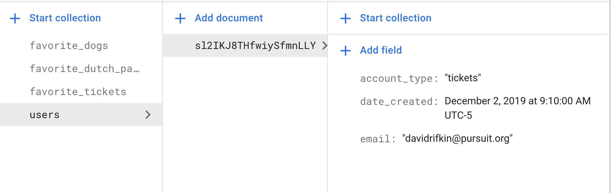
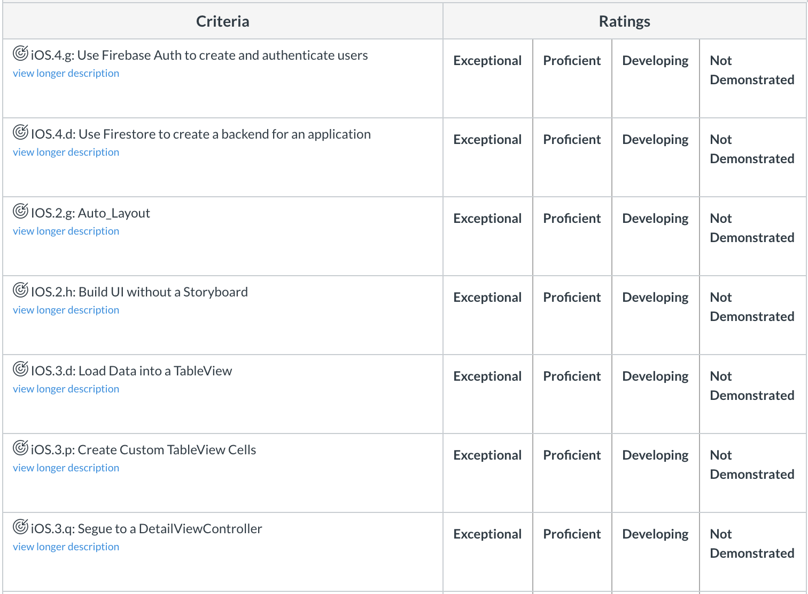
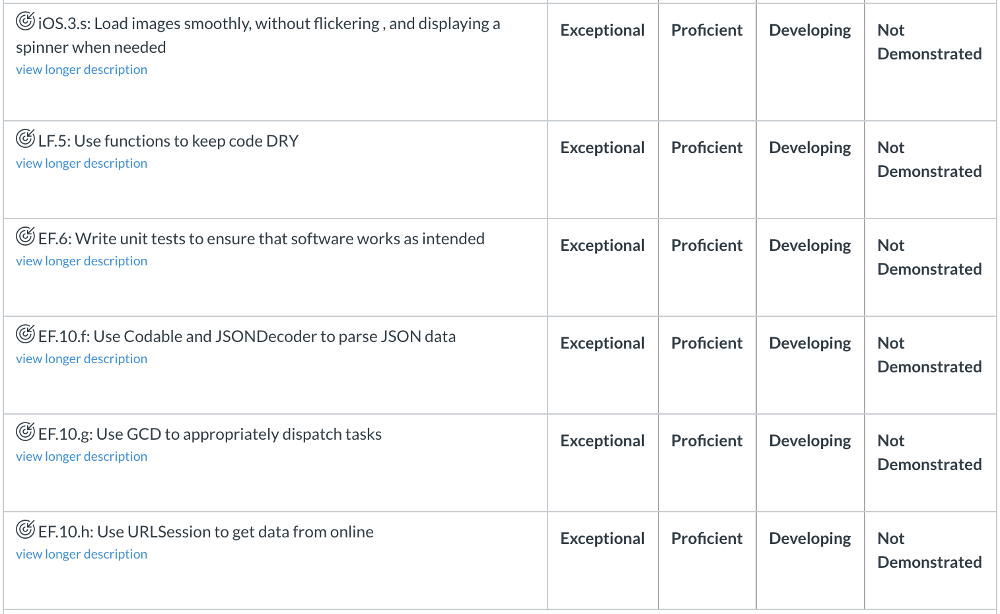
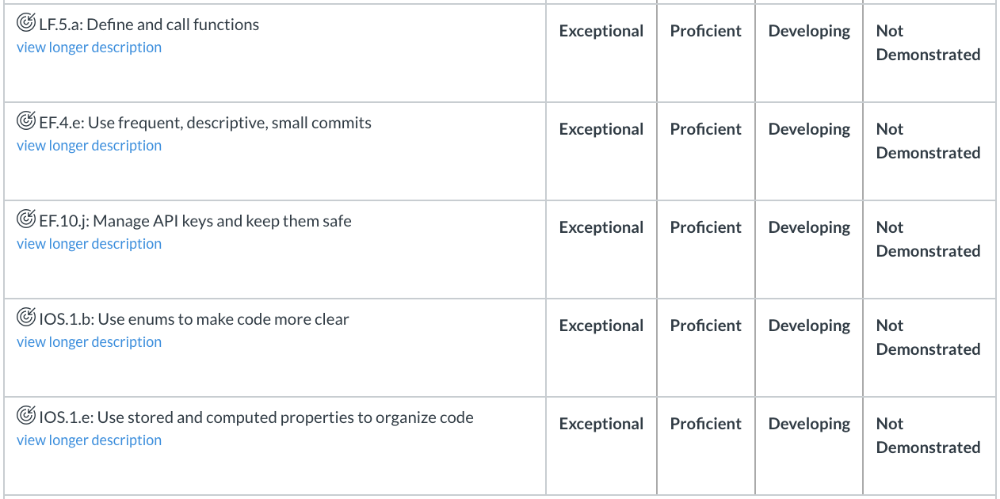
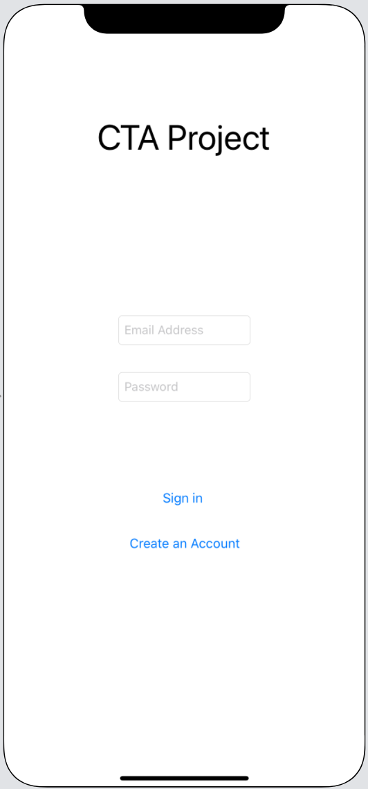
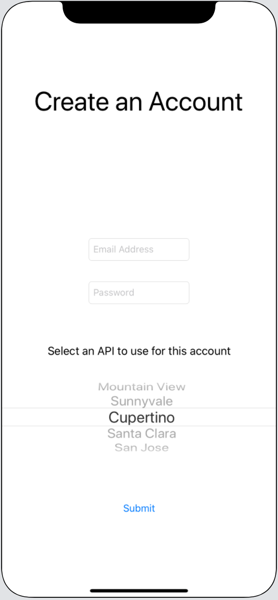
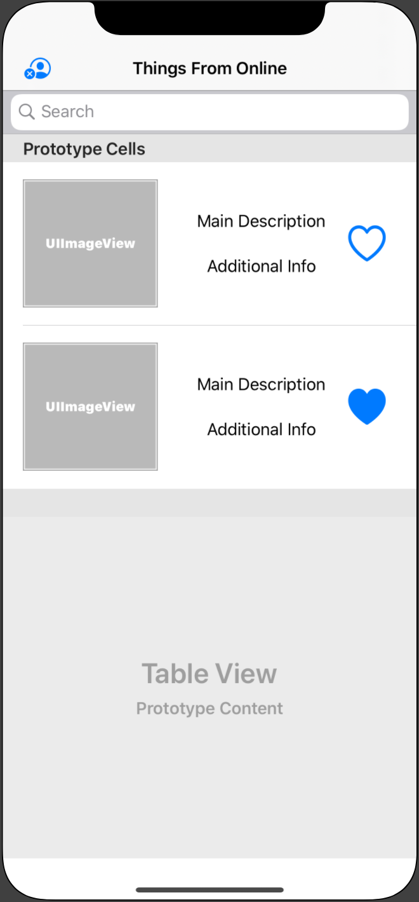
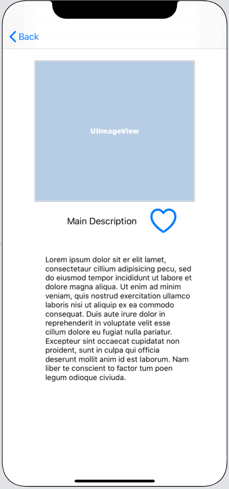
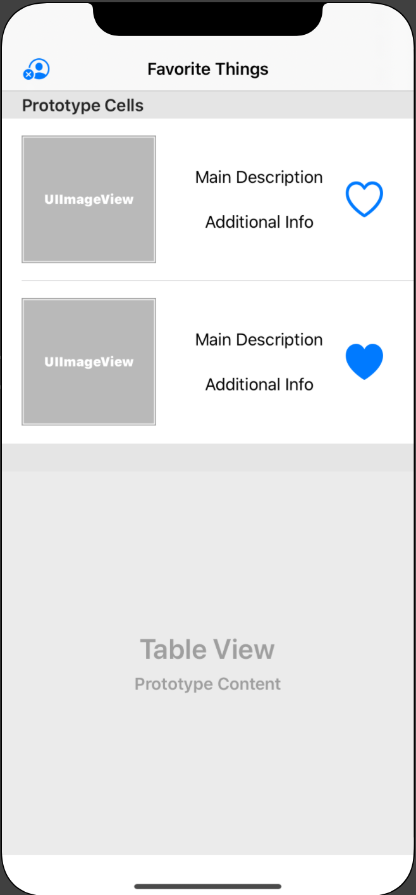

# Skyline
​
​
## Description 
​
Ever wish you could explore Rijksmuseum's art work and also look for fun events on Ticketmaster on the same app? No? Ok well it's because you could never imagine such an amazing combo but now you can!
Skyline lets you select a view, Art or Events, and from there your experience begins. If you select "Events" you get access to millions of tickets no matter where you are. Simply search by city or postal code and get a list of events nearby. You can view event details and if interested directed to the ticketmaster website to purchase tickets! If you choose "Art" you get to visit the Rijksmuseum from home. Discover works or art by simply searching from the comfort of your home (or where ever you are) and even get access to the art works details. 
What ever the experience, you can favorite and save items directly on the app and log in anywhere to access your favorites. You can even change your experience in settings and go back and forth, no limits!
​
​
## App Description
​
For this assessment, build an app that allows users to choose from a selection of APIs and pick their favorite items. You should create a Firebase-backed project with the following functionality:
​

**bold** 
​
## App Features 
​
- [x] Create Login Screen
- [x] User should be able to create account
- [x] User should be able to login
- [x] User should be able to select from two different API's
- [x] Once logged in, always uses the same API
- [x] Display data from API on table view
- [x] User should be able favorite information
- [x] User should be able to search through API
- [ ] Have fun
- [x] User should be able to logout
- [x] Segue to detail view
- [x] Detail should display image, description, title, and favorite button
- [x] Favoriting should change the state of the button ie: filled (on both table view and detail view)
- [ ] Navigation title should display the data they are recieving.
- [x] Favorites View controller displays all favorites
​
*Discalimer Use this checklist to keep track of where you are in the project. For more Detail Instructions refer to the readme 
​
## Frameworks
​
- Use Firebase Auth to manage account creation and signing in.
- Use Firebase Firestore to manage user accounts and the items that have been favorited.
​
​
## Auth
​
- A user should be able to create a new account by entering their email and password, and selecting the experience they wish to have in the app.
- A user should be able to log in to their account if they already have one.
- A user should be able to bypass log in if they are still logged in as the current user. You should *persist* that user's preferred experience so that the information can be retrieved when the app loads.
- A user should be able to log out of their account from a button in the list view controllers.
​
[Firebase Auth Documentation on "user lifecycle"](https://firebase.google.com/docs/auth/users#the_user_lifecycle)
​
[Firebase Auth Documentation for .signOut](https://firebase.google.com/docs/reference/ios/firebaseauth/api/reference/Classes/FIRAuth#-signout:).
​
​
### Here is a sample entry in a `users` collection:
​

​
## APIs
​
- A user must be able to select an "experience" when creating their account.
- When a user selects an experience, information to list in the app should be pulled from the the appropriate API.
- For each option, a user should have an app experience as outlined below:
​
| API Source | Requires API Key | Table View | Detail View |
|---|---|---|---|
| Ticketmaster | Yes | Use their [discovery API](https://developer.ticketmaster.com/products-and-docs/apis/discovery-api/v2/) to load all events at a location that the user searches for.  Include an image, the name of the event, and the time the event starts | In addition to the info from the Table View, display the price ranges and a link to the event.
| Rijksmuseum | Yes | Use their [Collection API](https://data.rijksmuseum.nl/object-metadata/api/) to load all museum items from a name that the user searches for.  Include an image and the title of the item. | Use the [Collection Details API](https://data.rijksmuseum.nl/object-metadata/api/) to load additional information about the select item including its plaque Description in English, its date it was created, and the place it was produced. Kijk uit voor dit schilderij "de nachtwacht." Het is erg groot.
​
​
## Rubric
​

​
# UI
​
​
## Login Screen
​
- Enter an email address.
- Enter a password.
- Log in to an existing account.
​

​
​
## Create Account Screen
​
- Select which API you want to get information from.
- Create a new account using email and password.
​

​
​
## List Items Screen
​
- Display a list of data from an API (call these "Things").
- The navigation title should tell the user what kind of Things they are receiving from online.
- Entering text in the search bar searches for and displays relevant Things.
- Have a favorite button in each cell.
- Tapping the favorite button should fill the UI and make a call to favorite for that Thing in the backend. Animate this UI change.
- Selecting a cell should segue to a detail View Controller that displays additional information about that Thing.
- The navigation bar should have an item that allows the user to log out.
​

​
​
## Item Detail Screen
​
- Show additional information about the selected Thing.
​

​
​
## Favorite Items Screen
​
- Display a list of Things that have been favorited by the user.  
- The navigation title should tell the user what kind of Things they have favorited.
- Each cell should contain a favorite button which the user can tap to unfavorite the Thing. Tapping the button should change both the UI and the backend.
- The navigation bar should have an item that allows the user to log out.
​

​
​
## Stretch
​
Add a third tab, Settings, that allows a user to:
- change their app experience. This should change the user's experience in-app, and update their user model in FireStore.
- clear all favorites for the current experience.
